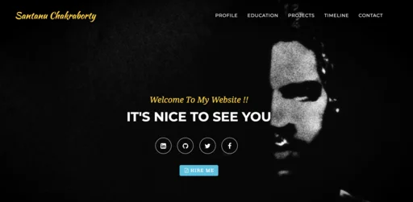
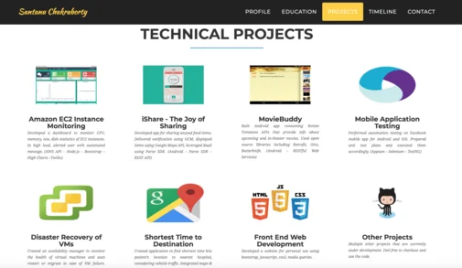
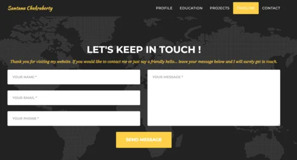

# Santanu Chakraborty

🌺 **Welcome to my portfolio!** Check it out: [https://santanusetu.github.io/](https://santanusetu.github.io/)

## About Santanu Chakraborty

Santanu is a software engineer with professional experience in application development, design, and delivery of solutions that meet business demands. He is drawn to innovative and impactful product ideas that have high visibility and make a meaningful difference.

Currently working at **Visa Inc.**, he brings professional experience from his time as a Senior Systems Engineer at **Infosys Ltd, Bangalore** for over two years, and as an Android Developer intern at **@WalmartLabs, California** for seven months. 

He graduated from **San Jose State University** with a Master's degree specializing in Distributed Systems in Software Engineering.

## Portfolio Screenshots

&nbsp;&nbsp;
&nbsp;&nbsp;

## Featured Projects

- **Amazon EC2 Instance Monitoring** - Dashboard to monitor CPU, memory, network, and disk statistics
- **iShare - The Joy of Sharing** - Android app for sharing unused food items
- **MovieBuddy** - Android app consuming Rotten Tomatoes APIs
- **Mobile Application Testing** - Automation testing frameworks
- **Disaster Recovery of VMs** - Availability manager for virtual machines
- And many more...

## Let's Connect

Always open to discussing new opportunities, innovative projects, or just having a friendly conversation!

- **LinkedIn:** [santanu16](https://www.linkedin.com/in/santanu16)
- **GitHub:** [santanusetu](https://github.com/santanusetu)
- **Twitter:** [@theSeffect](https://twitter.com/theSeffect)
- **Facebook:** [santanu.chakraborty.967](https://www.facebook.com/santanu.chakraborty.967)
- **Stack Overflow:** [santanu](http://stackoverflow.com/users/2385468/santanu)
- **Email:** santanu.setu@gmail.com

## Resume

📄 [Download my resume](files/santanuresume.pdf)

---

*Thank you for visiting! Feel free to reach out if you'd like to connect or collaborate.*
